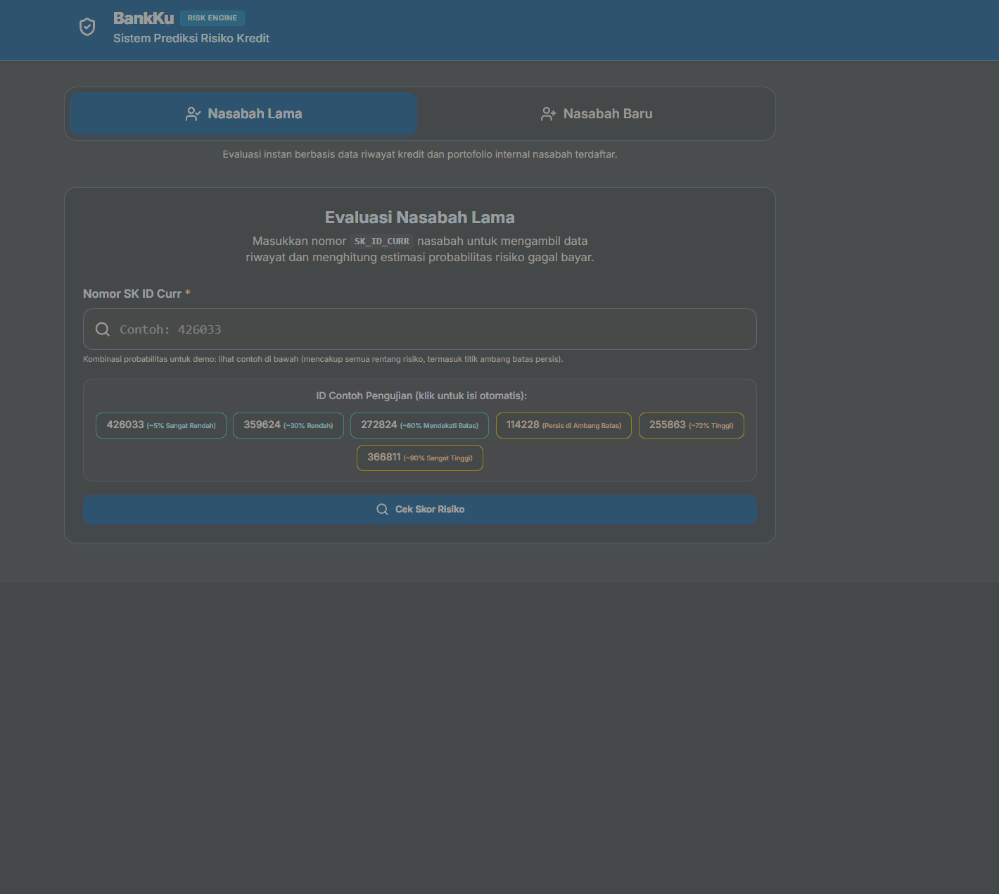

# Credit Risk Scoring — Home Credit Default Risk

## Demo

*Demo di atas menunjukkan alur Mode Existing (lookup nasabah + prediksi + SHAP reasons) dan Mode Baru (form manual + hasil "Perlu Verifikasi Manual"). Dijalankan secara lokal — lihat [Bagian 9](#9-cara-menjalankan-project) untuk cara run sendiri.*

## 1. Business Problem

Banyak orang, terutama populasi unbanked atau tanpa riwayat kredit yang cukup, kesulitan mendapatkan akses pinjaman dari lembaga keuangan formal. Populasi ini sering menjadi target pemberi pinjaman yang tidak dapat dipercaya karena minimnya data untuk menilai kelayakan kredit mereka.

Home Credit berupaya memperluas inklusi keuangan bagi populasi ini dengan memberikan pengalaman pinjaman yang aman dan positif. Namun, tantangan utamanya adalah membangun sistem yang dapat:

- Memastikan klien yang mampu membayar tidak ditolak (menghindari kehilangan bisnis dan memperluas akses keuangan).
- Memastikan pinjaman diberikan dengan kalender pokok, jatuh tempo, dan pembayaran yang realistis, sehingga memberdayakan klien untuk sukses secara finansial.
- Meminimalkan risiko gagal bayar (default) yang dapat merugikan perusahaan.

## 2. Data Science Problem

Masalah bisnis ini diterjemahkan menjadi masalah klasifikasi biner: memprediksi probabilitas seorang pemohon akan mengalami kesulitan pembayaran (TARGET = 1) atau melunasi pinjaman dengan baik (TARGET = 0), berdasarkan data aplikasi, riwayat kredit eksternal, dan riwayat transaksi sebelumnya.

Project ini tidak hanya berfokus pada akurasi prediksi, tetapi juga pada interpretability — yaitu kemampuan menjelaskan mengapa seorang pemohon diprediksi berisiko tinggi atau rendah, sehingga hasilnya dapat digunakan sebagai business recommendation yang actionable bagi tim credit risk/underwriting.

## 3. Target Audiens

- Tim Credit Risk / Underwriting — menggunakan model untuk mendukung keputusan approval/rejection pinjaman.
- Manajemen/Stakeholder non-teknis — membutuhkan penjelasan sederhana mengapa suatu keputusan diambil (melalui feature importance dan business recommendation).
- Recruiter/Hiring Manager — sebagai portfolio yang menunjukkan kemampuan end-to-end data science: dari business understanding, EDA, feature engineering, modeling, hingga komunikasi hasil.

## 4. Tujuan Project

1. Membangun model klasifikasi untuk memprediksi probabilitas default pemohon pinjaman.
2. Mengidentifikasi fitur-fitur paling berpengaruh terhadap risiko default (feature importance).
3. Menyusun business recommendation yang dapat dijelaskan kepada stakeholder non-teknis mengenai faktor-faktor yang menyebabkan penolakan pinjaman.

## 5. Success Metrics

| Metrik | Alasan Pemilihan |
|---|---|
| AUC-ROC | Metrik utama, sesuai kriteria evaluasi resmi kompetisi Kaggle; cocok untuk data yang sangat imbalanced antara kelas default dan tidak default. |
| Precision & Recall (kelas minoritas) | Untuk memahami trade-off antara salah menolak pemohon layak vs salah menyetujui pemohon berisiko. |
| Feature Importance (SHAP / permutation importance) | Untuk mendukung sisi interpretability dan business recommendation. |

## 6. Dataset

Dataset yang digunakan adalah Home Credit Default Risk dari kompetisi resmi Kaggle:
[https://www.kaggle.com/competitions/home-credit-default-risk/data](https://www.kaggle.com/competitions/home-credit-default-risk/data)

| File | Deskripsi |
|---|---|
| application_train.csv / application_test.csv | Data utama aplikasi pinjaman, termasuk kolom target TARGET. |
| bureau.csv | Riwayat kredit klien dari institusi finansial lain. |
| bureau_balance.csv | Data bulanan riwayat kredit dari bureau.csv. |
| previous_application.csv | Riwayat aplikasi pinjaman sebelumnya di Home Credit. |
| POS_CASH_balance.csv | Riwayat bulanan pinjaman POS/cash sebelumnya. |
| credit_card_balance.csv | Riwayat saldo bulanan kartu kredit sebelumnya. |
| installments_payments.csv | Riwayat pembayaran cicilan. |
| HomeCredit_columns_description.csv | Deskripsi lengkap seluruh kolom di semua file. |

## 7. Scope & Constraints

- Tahap awal project akan berfokus pada application_train.csv dan application_test.csv, kemudian dilanjutkan dengan penggabungan tabel lain (bureau, previous_application, dll) pada tahap Feature Engineering.
- Model yang dibangun bersifat dummy project untuk keperluan portfolio, bukan untuk digunakan dalam keputusan kredit nyata.

## 8. Struktur Project
Project-1-Home-Credit-Default-Risk-main/
├── README.md
├── pyproject.toml # Package config, agar src/ bisa di-import universal (pip install -e .)
├── data/
│ ├── raw/ # Dataset mentah dari Kaggle, tidak diubah
│ └── processed/ # Hasil cleaning & feature engineering (v1-v3)
├── notebooks/
│ ├── 01_eda.ipynb
│ ├── 02_cleaning.ipynb
│ └── 11_evaluation.ipynb
├── src/ # Package reusable: cleaning, feature engineering, modeling
│ ├── _init_.py
│ ├── config.py
│ ├── cleaning.py
│ ├── cleaning_auxiliary.py
│ ├── features.py
│ ├── features_v2.py
│ ├── features_v3.py
│ └── modeling/
│ ├── _init_.py
│ ├── train.py # CatBoostColumnSelector & training pipeline (versi lengkap)
│ ├── predict.py
│ └── evaluate.py
├── models/
│ └── catboost_v3/
│ ├── catboost_v3_pipeline.joblib
│ ├── catboost_v3_oof.csv
│ ├── catboost_v3_config.json
│ └── catboost_v3_metrics.json
├── docs/
│ └── explainability.md # Detail lengkap SHAP & interpretability model
├── reports/
│ └── figures/
│ └── demo.gif # GIF demo aplikasi (lihat bagian atas README)
├── FastAPI/ # Backend model serving (lihat FastAPI/README.md)
│ ├── app/
│ ├── modeling/ # Salinan minimal CatBoostColumnSelector, dibutuhkan joblib.load()
│ ├── tests/
│ └── requirements.txt
└── requirements.txt

## 9. Cara Menjalankan Project
git clone <repo-url>
cd credit-risk-scoring
pip install -r requirements.txt
pip install -e .

Download dataset dari link Kaggle di atas, letakkan di `data/raw/`, lalu jalankan notebook secara berurutan mulai dari `01_eda.ipynb`.

Untuk menjalankan backend API secara lokal, lihat instruksi lengkap di [`FastAPI/README.md`](FastAPI/README.md).

## 10. Status Project

**Tahap Data Science** (Problem Definition → Data Collection → Cleaning → EDA → Feature Engineering → Modeling → Evaluation): **SELESAI**.

**Tahap Deployment**: Backend FastAPI untuk model serving sudah dibangun dan diuji **lengkap secara lokal** — 14/14 unit test schema passed, dan functional testing end-to-end (Mode Existing, Mode Baru, SHAP reasons, export PDF) semua berhasil tanpa error.

Deployment publik sempat dicoba di dua platform (Vercel, lalu Hugging Face Spaces) namun dihentikan setelah menemui limitasi yang tidak sepadan untuk skala project dummy ini: bundle size serverless function Vercel (limit 500MB) tidak cukup untuk stack ML (`catboost`+`scikit-learn`+`pandas`+`shap`), dan Docker Space di Hugging Face kini memerlukan subscription berbayar. Keputusan diambil untuk memprioritaskan kualitas dokumentasi, testing lokal yang menyeluruh, dan demo visual (GIF di atas) — dibanding memaksakan hosting berbayar demi satu live link semata.

**Tahap Documentation**: **SELESAI** — README dan dokumentasi explainability sudah disusun untuk keperluan portfolio.

## 11. Model, Deployment & Explainability

**Model final:** CatBoost v3 (pipeline tunggal, dipilih setelah dibandingkan dengan Logistic Regression, Random Forest, LightGBM, XGBoost, dan beberapa varian ensemble/stacking — lihat `notebooks/11_evaluation.ipynb` untuk perbandingan lengkap).

**Hasil evaluasi pada holdout set** (61.503 baris, stratified 80/20 split, di-freeze sejak awal untuk mencegah data leakage):

| Metrik | Nilai |
|---|---|
| ROC-AUC | 0.7862 |
| PR-AUC | 0.2838 |
| Precision | 27.9% |
| Recall | 44.6% |
| F1-Score | 0.343 |

**Threshold keputusan:** 0.6669 — dipilih menggunakan pendekatan cost-based (asumsi biaya False Negative : False Positive = 5:1), dihitung murni dari Out-of-Fold prediction, **tidak pernah** dioptimasi menggunakan holdout set.

**Dua mode aplikasi di backend:**
- **Mode Existing** — lookup nasabah dari data holdout demo, merepresentasikan kondisi ideal dengan seluruh 739 fitur tersedia.
- **Mode Baru** — nasabah mengisi form manual tanpa histori kredit. Kombinasi data ini terbukti **out-of-distribution** (0 dari 307.511 baris training memiliki kombinasi identik), sehingga keputusan selalu dikunci ke **"Perlu Verifikasi Manual"**, tidak pernah auto-approve.

**Interpretability:** Model dijelaskan menggunakan SHAP (`TreeExplainer`) untuk setiap prediksi Mode Existing. Detail lengkap metodologi, contoh kasus nyata, dan keterbatasannya ada di [`docs/explainability.md`](docs/explainability.md).

